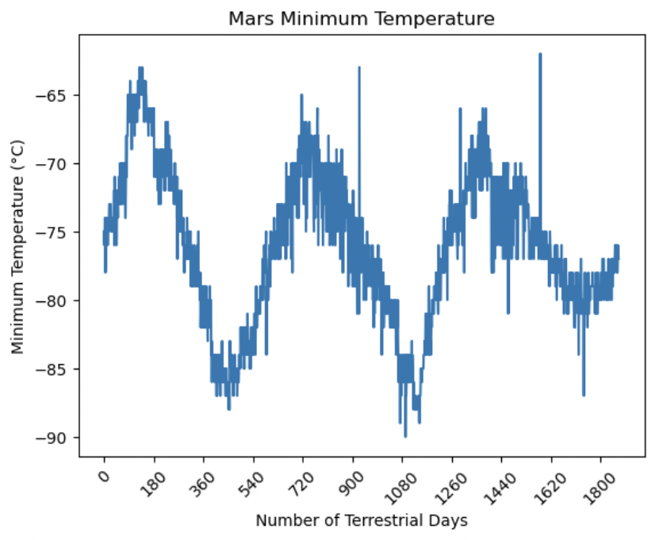

# Beautiful Soup Challenge
Scrape Mars data from various web pages using Beautiful Soup. Store and analyse these data using Pandas!

Created and submitted for an assignment for Monash University Data Analytics Boot Camp (August 2023).

## Table of Contents

- [General info](#general-info)
- [Technologies](#technologies)
- [Screenshot](#screenshot)
- [Code example](#code-example)
- [References](#references)

## General info

### part_1_mars_news_Final.ipynb

- Scrapes Mars-related news titles and previews using Beautiful Soup. 
- Stores scraped data in List of Dictionaries (for JSONification).  
- Exports List of Dictionaries as JSON file.

### part_2_mars_weather_Final.ipynb

- Scrapes Mars weather data from table on web page using Beautiful Soup. 
- Stores scraped data in List of Dictionaries.
- Converts List into Pandas dataframe for data analysis and visualisation.
- Plot Mars' average temperature and pressure against month using Matplotlib.
- Determines number of Earth days in Martian year by visualising Martian cyclic temperature fluctuations over ~1800 Earth days using Matplotlib.
- Exports Pandas dataframe to CSV file.

## Technologies

Project created and run using:

- Python 3.10.9
  - Pandas 1.5.3
  - NumPy 1.24.3
  - Matplotlib 3.7.1
- Beautiful Soup 4.12.2
- Visual Studio Code 1.79.2
- Jupyter Notebook 5.3.0

## Screenshot

#### Minimum Temperature Fluctuations over Time on Mars



## Code example

```python
# Code Snippet from part_2_mars_weather_Final.ipynb
#################################################    

# Loop through the scraped data to create List of Column Headers

# Find Header names
columns = soup.find_all('th')

# Loop through Header Names and append to List
for column in columns:
    column_headers.append(column.text)

# Extract all rows of data
rows = soup.find_all(class_ = 'data-row')

# Loop through scraped data to create List of Rows (Dictionaries)
for row in rows:
    column_values = row.find_all('td')
    
    # Create Dictionary for each Row/Index
    weather_dict = {column_headers[0]: column_values[0].text,
                    column_headers[1]: column_values[1].text,
                    column_headers[2]: column_values[2].text,
                    column_headers[3]: column_values[3].text,
                    column_headers[4]: column_values[4].text,
                    column_headers[5]: column_values[5].text,
                    column_headers[6]: column_values[6].text}
    
    # Append Row/Dictionary to List
    weather_list.append(weather_dict)
```

## References

- Change data types of Pandas dataframe columns from object to datetime or numeric data types for analysis:
  - https://www.geeksforgeeks.org/change-data-type-for-one-or-more-columns-in-pandas-dataframe/

- Code, in general, was adapted from Monash University Data Analytics Boot Camp 2023 course learning material.


Created and written by Samuel Palframan - August 2023.
